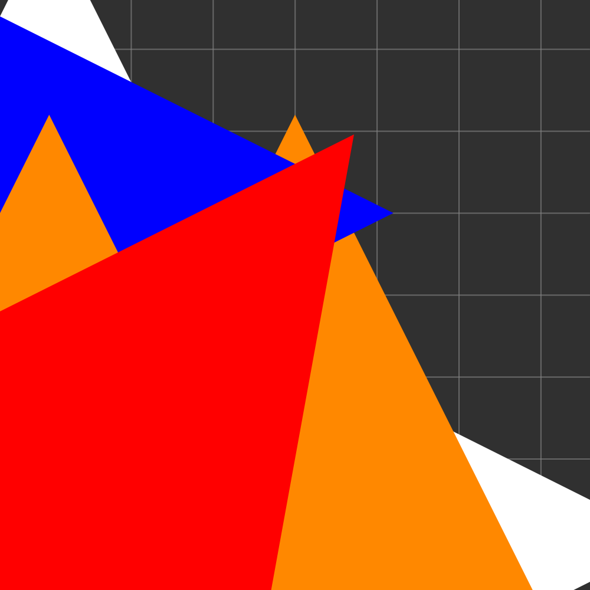
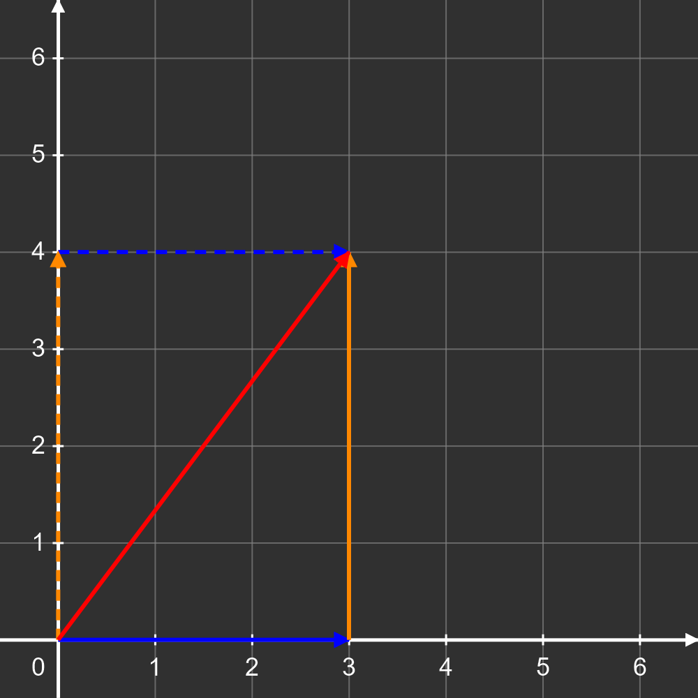

# WebKit Superposition arrowheads

The first board from tests/fixtures/static-superposition.json was rendered with
Playwright 1.49.1 / WebKit 18.2 using the iPad (gen 7) landscape device profile
(500 CSS px board, device scale factor 2). The baseline was the committed
dist/static.js; the fixed build was the working tree's dist/static.js.
The same before/after result was checked with dist/index.js.

| Bundle | Baseline red pixels | Fixed red pixels |
| --- | ---: | ---: |
| static.js | 500,688 | 9,545 |
| index.js | 500,688 | 9,545 |

Red pixels were counted in the 1000 x 1000 board screenshot when
r > 180, r > 1.6*g, and r > 1.6*b.

Playwright WebKit 26.5 rendered the baseline and fixed static bundles
with identical pixels. WebKit's [Safari Technology Preview 235 release notes](https://webkit.org/blog/17739/release-notes-for-safari-technology-preview-235/)
record a fix for the combination of markerUnits=strokeWidth and
vector-effect=non-scaling-stroke. These checks use emulated iPad settings,
not a physical iPad or Apple's Safari application.
